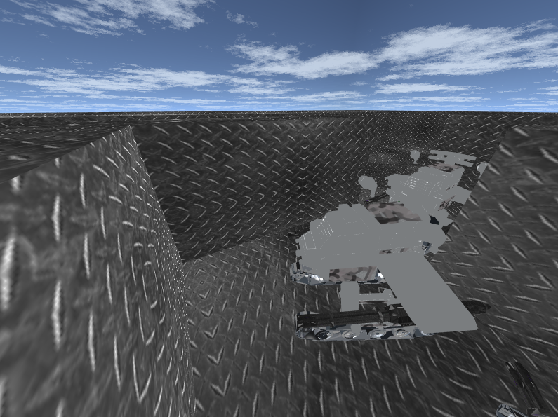
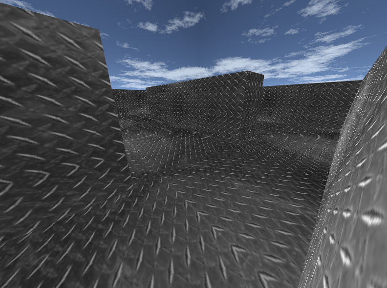

# AirStrike 
- Team project for CG course, which  achieve the airstrike effects using native WebGL.
- Since texture File is fairly big,  it's slow to git clone.
- Use [Parcel](https://parceljs.org) to pack the project.
- We write `aconvert_obj_to_json.js` to convert obj file to json file.


### RUN & BUILD

- (DEBUG) After install parcel, run

  ```shell
  npm install -g parcel
  parcel index.html
  ```

- Build

	```shell
   npm install -g http-server
   parcel build index.html
 cd dist
   http-server
  ```
  


### Screen Shots



